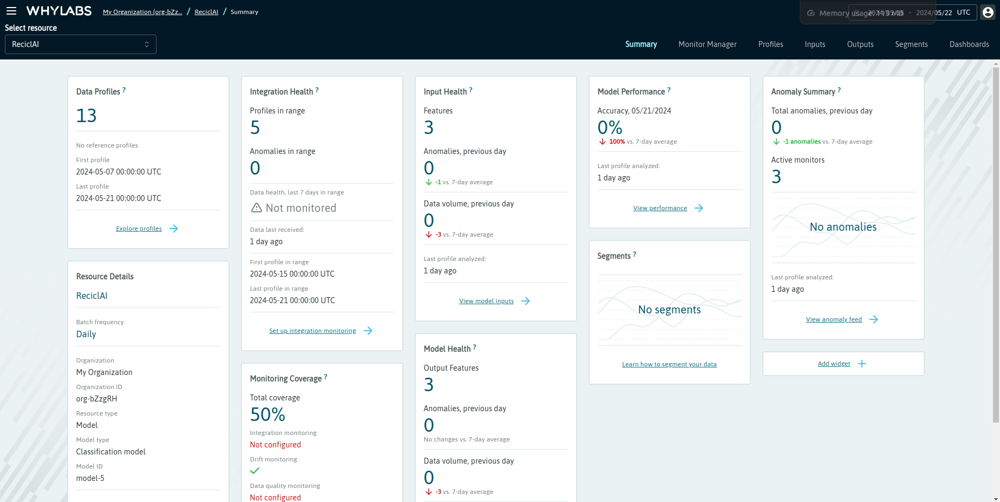

## CLARA Monitor part

## Project description

A completar...

##  Logging / Dashboards

The extern logging and monitoring module tracks the model's performance in production using WhyLogs and WhyLabs. WhyLogs is used to log performance metrics, such as accuracy, precision, recall, and the number of predictions made over time. WhyLabs provides a monitoring platform that visualizes these metrics and helps identify trends and potential issues. This module also monitors the system for any anomalies or significant drops in performance, triggering alerts if necessary. This ensures that the model remains reliable and any problems are addressed promptly.

The Logging/Monitor module is responsible for continuously monitoring the performance of the classification model in production. It logs performance metrics, detects any drifts or degradation in model accuracy, and stores these logs for further analysis. This module uses WhyLogs for logging and APScheduler to schedule regular monitoring tasks. MongoDB is used to store logs and related metadata. Here is a detailed description of its functionalities:

### Key Features:

1. **Performance Logging**:
   - Utilizes WhyLogs to log performance metrics of the classification model.
   - Monitors various aspects of the model's performance, such as accuracy, precision, and recall.

2. **Drift Detection**:
   - Detects any drifts in the model's performance over time.
   - Identifies potential issues that may require retraining or adjustment of the model.

3. **Data Storage**:
   - Stores logged performance metrics and related metadata in a MongoDB database.
   - Provides a robust system for retrieving and analyzing historical performance data.

4. **Scheduling**:
   - Uses APScheduler to schedule regular monitoring tasks.
   - Ensures continuous and timely monitoring of the model's performance.

### Detailed Functionalities:

1. **Environment Configuration**:
   - Sets environment variables for WhyLabs and MongoDB connection details.
   - Configures the organization ID, API key, and dataset ID for WhyLabs.

2. **Database Connection**:
   - Establishes a connection to MongoDB using the provided URI and database name.
   - Handles connection errors and ensures reliable database access.

3. **Monitoring Task**:
   - `check_and_log_new_entries()`: Fetches new entries from the database and logs their performance metrics.
   - Integrates with WhyLogs to create and store performance logs.

4. **Scheduler Initialization**:
   - Initializes a blocking scheduler to run the monitoring task at regular intervals.
   - Ensures the monitoring process runs continuously without manual intervention.

5. **Error Handling**:
   - Log errors encountered during database connection and monitoring tasks.
   - Provides feedback on the status of the monitoring process.

This module ensures continuous tracking of the classification model's performance, allowing for timely detection of issues and maintaining the model's accuracy and reliability over time. Integrating MongoDB provides a reliable storage solution for performance metrics and related data. It can be deployed simultaneously with the internal Monitor module.

## Monitor

The  intern monitoring module is designed to track the performance of the classification model in production. Using charts, it provides a web interface to visualize various performance metrics in a selected time range. This module utilizes Flask for the backend, MongoDB for data storage, and Chart.js for creating interactive charts. Here is a detailed description of its functionalities:

### Key Features:

1. **Web Interface**:
   - Flask is utilized to create a web interface for monitoring.
   - Provides different tabs to visualize various aspects of model performance.

2. **Data Fetching**:
   - Fetches data from MongoDB based on user-specified date ranges.
   - Calculates performance metrics such as precision, accuracy, recall, and F1 score.

3. **Charts**:
   - Uses Chart.js to create interactive charts for visualizing metrics.
   - Includes line charts for overall metrics and bar charts for class-specific metrics.

### Detailed Functionalities:

1. **Environment Configuration**:
   - Configures connection details for MongoDB.

2. **Database Connection**:
   - Establishes a connection to MongoDB using the provided URI and database name.
   - Fetches data based on the date range specified by the user.

3. **Metrics Calculation**:
   - Calculates daily metrics for precision, accuracy, recall, and F1 score.
   - Aggregates these metrics to provide an overall performance view.

4. **Chart Initialization**:
   - Initializes Chart.js charts for visualizing metrics.
   - Includes line charts for daily metrics and bar charts for metrics by class.

5. **Web Interface Tabs**:
   - **Main Tab**: Provides an overview of validated samples and metrics.
   - **Metrics Tab**: Displays separate line charts for precision, accuracy, recall, and F1 score.
   - **Samples by Class Tab**: A pie chart of validated samples by class.
   - **Metrics by Class Tab**: Displays bar charts of precision, recall, and F1 score by class.
   - **Training Data Tab**: A pie chart of samples by class of training dataset.

This module can be modified depending on the task's necessities and deployed simultaneously with the external Logs / Dashboards module.
